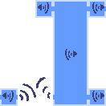

## SOTN Shuffler Devlog

### Fixing the waterfall sound bug has turned into a side project all its own

The `Waterfall Room` has four rooms adjacent to it, and in the vanilla game those rooms each have a single instance of the `Waterfall Sound Entity` responsible for fading and panning the waterfall sound appropriately to give you the auditory sensation of "approaching" a large waterfall.

When the sound entities are aligned properly, waterfall sounds produced in any one of these rooms are controlled by the entities in the other rooms and contained inside their proper area.

When [the Shuffler](https://github.com/SestrenExsis/SOTN-Shuffler) moves one of the rooms adjacent to the `Waterfall Room` somewhere else, this can cause auditory bugs. When the sound entities are misaligned, waterfall sounds can "leak" into other rooms, sometimes permanently staying on until you either leave the stage or find another room with one of these sound entities.

The [original solution](https://github.com/SestrenExsis/SOTN-Shuffler/pull/118) to this problem was to move these special sound entities to whatever room had been placed adjacent to the `Waterfall Room`, and this solution appeared to solve the issue once and for all. There were, however, a few corner cases still left to handle.

If it turns out that one of the Save Rooms is placed next to the `Waterfall Room` in `Underground Caverns`, all other Save Rooms in the stage will inherit the same Waterfall Sound Entity. This can result in a number of [auditory glitches](https://github.com/SestrenExsis/SOTN-Shuffler/issues/175), such as Save Rooms that aren't even connected to the `Waterfall Room` having a waterfall sound, or two Save Rooms that are both connected to the `Waterfall Room` sharing the same panning effect, only one of which sounds correct.

It makes sense that this would happen if you consider how the Entity Layout table works. With the exception of the False Save Room that leads to the fight with Succubus, all Save Rooms in the game are generally assigned the same row in their respective stage's Entity Layout table. This means it is technically  impossible[^1] to alter one Save Room without affecting all others.

One solution would be to disallow Save Rooms from being placed next to the `Waterfall Room` at all, and there is precedent in the vanilla game that supports this as the preferred solution. The vanilla game would likely have not allowed Save Rooms to be adjacent to `Waterfall Room` just to avoid having to devote an Entity Layout row to it.

There is one other pair of rooms in `Underground Caverns` that share an Entity Layout row, and that is the unceremoniously-named `Room ID 10`, and `Scylla Worm Room`[^2]. These rooms will suffer from the same limitation as Save Rooms in not allowing entites to be moved into them without it affecting both rooms.

[^1]: It is not, strictly speaking, impossible, but it cannot be done without assigning one of the Save Rooms to its own unique row in the Entity Layout table, and it's possible there may not even be room to do so.

[^2]: Although `Scylla Worm Room` does have entities in it when you first encounter it in the game, those entities and that version of the room actually come from a separate stage called `Boss - Scylla` that clones a few of the rooms from `Underground Caverns` and has a few of its own unique behaviors such as the flooding effect. In the non-Boss version of the stage, `Scylla Worm Room` is devoid of entities.

###### 🍂 created on 2025-11-26, last updated on 2025-11-26

## Studying

### Calculating which study day today is using Wolfram Alpha

You can use [Wolfram Alpha](https://www.wolframalpha.com/) to figure out which "study day" you are on (say, for using flashcards with the [Leitner system](https://en.wikipedia.org/wiki/Leitner_system)) with the following URL:

[https://www.wolframalpha.com/input/?i=%28%28%28number+of+days+since+2000%29+%2F+day%29+%2B+7%29+mod+10](https://www.wolframalpha.com/input/?i=%28%28%28number+of+days+since+2000%29+%2F+day%29+%2B+7%29+mod+10)

If you need your first day of study to start at 0, you can adjust the offset (in the example above, 7) to suit your needs. If you need a different number of study days to cycle through, adjust the modulus (in the example above, 10).

###### 🍂 created on 2021-05-31, last updated on 2022-01-20

## Categorization system
🍂 _Leaves_ are for random thoughts that aren't likely to be revisited once posted
